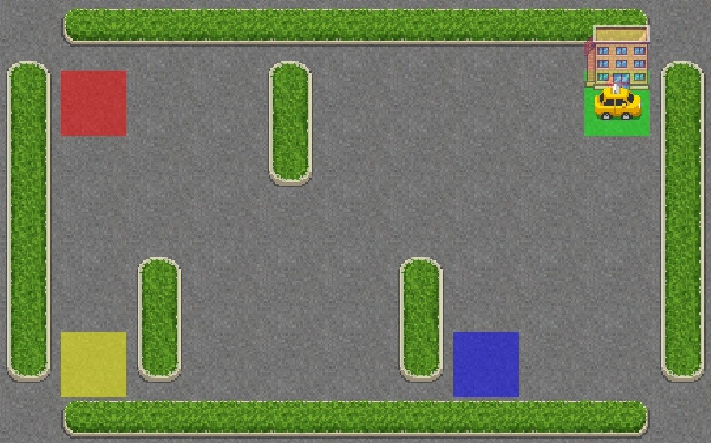

# Reinforcement-Learning

This is a simple reinforcement learning training and test algorithm on the *Taxi-v3*  environment from the Toy Text library, of **Gym OpenAI**.  
In this environmet, there is an agent, the taxi, which can perform six actions: go north, south, east, west, pick up and drop off the passenger. The area is a discrete space, made by five rows and five columns, 4 of them being the pick up and drop off points, where the passenger can be. The total possible states are 500, considering that there are 25 cells where the taxi can be, 4 possible destinations, and 5 possible states of the passenger (the four spots and the cab itself).  
The idea is to train the agent to go towards the passenger, pick it up, drive towards the desired spot, and drop it in the less time steps possible.  
In order to do so, three kinds of rewards were given: +20, when the passenger is dropped in the right place, -1, at each time step for which the taxi doesn't make it to the destination, and -10 whenever the agent tries to pick up or drop off the passenger in the wrong place.  
  
Starting the kernel, first it is provided the training of the agent, on 10000 episodes; then, this knowledge is tested on 10 episodes.  
The following window will be opened when starting the test, in order to visualize the agent in the environment, for all the 10 test episodes.    
In this image, it is shown one example of initial frame.  
  
  
In the following picture, it is shown the final frame of the same example.

At each iteration, the environment is restarted in a new random position.
