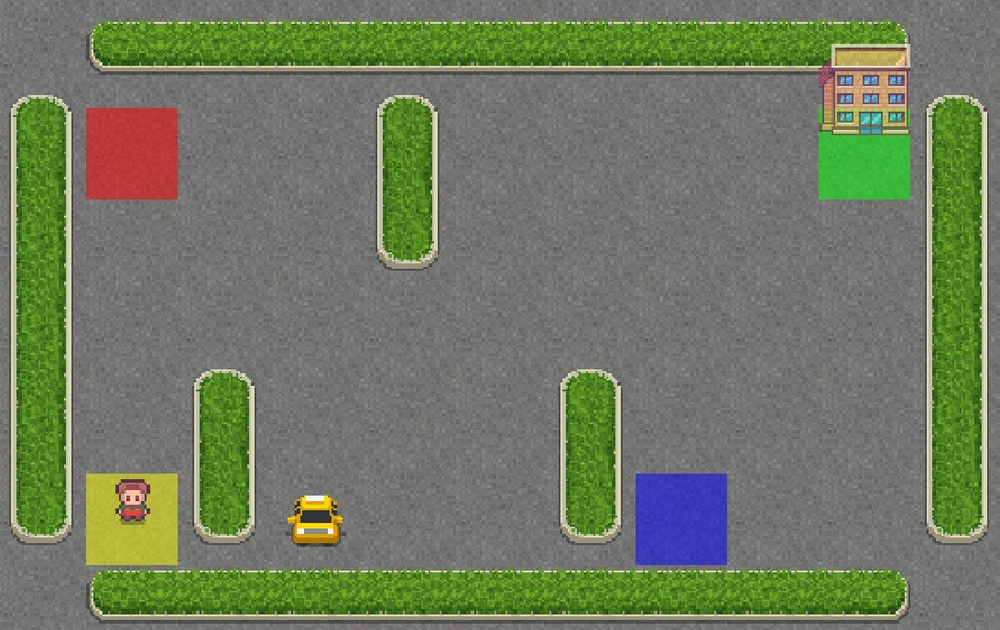

# Reinforcement-Learning

This is a simple reinforcement learning trining and test algorithm on the *Taxi-v3*  environment from Toy Text, of **Gym OpenAI**.  
Starting the kernel, first it is provided the training of the agent, on 10000 episodes; then, this knowledge is tested on 10 episodes.  
The following window will be opened when starting the test, in order to visualize the agent in the environment, for all the 10 test episodes.  
At each iteration, the environment is restarted in a new random position.   
In this image, it is shown one example of initial frame.  
  

